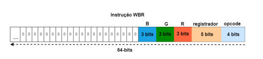
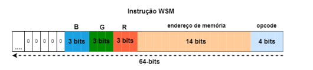

# Sistemas Digitais

Este projeto tem como objetivo desenvolver uma biblioteca com funções gráficas para o 
Processador Gráfico desenvolvido no trabalho de conclusão de curso do Engenheiro da 
Computação Gabriel Sá Barreto Alves (Link do trabalho: https://drive.google.com/file/d/1MlIlpB9TSnoPGEMkocr36EH9-CFz8psO/view).  
Essas funções foram desenvolvidas em linguagem assembly e deve ser integrada com o jogo Tetris desenvolvido
no problema 1 (https://github.com/Fernanda-Marinho/PBL-TEC499) desta disciplina. A integração das funções com o jogo
foi feita em linguagem C. Neste projeto foi utilizada a plataforma de desenvolvimento DE1-SoC. 


# Equipe:
- [Camila de Araújo Bastos](https://github.com/Caamilab)
- [Fernanda Marinho Silva](https://github.com/Fernanda-Marinho/)
- [Gabriel Santos Cruz](https://github.com/GabrielSantosCruz)


# Executando o Projeto
### Clonando o Repositório
```bash
git clone https://github.com/GabrielSantosCruz/gpu-lib 
cd gpu-lib/

```
### Executando
```bash
cd scripts/ 
sudo make run

```

# Introdução 

O trabalho de conclusão de curso utilizado como base para o desenvolvimento deste projeto propõe
o desenvolvimento de uma arquitetura baseada em sprites para criar jogos 2D usando dispositivos FPGA.
Essa arquitetura visa facilitar a compreensão dos conceitos de sistemas digitais e a integração entre hardware e 
software por meio de uma abordagem prática e interativa. No trabalho ainda há a inclusão de jogos como Asteroids e Space Invaders,
porém no presente projeto esses jogos não foram implementados. 

# Mapeamento de memória 

O mapeamento de memória é um processo necessário para possibilitar a interação direta com o hardware da placa FPGA. Essa interação é feita através da abertura de arquivos especiais e do mapeamento de memória, que permite o acesso aos recursos de hardware por meio de endereços de memória específicos. O processo é dividido em duas etapas principais:

## Passo 1: Abertura do `/dev/mem`
O arquivo especial **`/dev/mem`** é utilizado para permitir o acesso direto ao hardware. Ao abrir este arquivo com permissões de leitura e escrita, o código em assembly garante que será possível acessar e modificar os registros físicos, além de sincronizar adequadamente as operações de entrada/saída (I/O).

## Passo 2: Mapeamento da Memória
Após a abertura do arquivo, o próximo passo é realizar o mapeamento de memória. O código define o endereço base do **FPGA Bridge** como **0xff200**, que marca o ponto inicial na memória física a ser acessada. A extensão da área de memória (span) é configurada como **0x1000**, especificando o tamanho total da região a ser mapeada. O sistema operacional atribui um endereço virtual para esta área mapeada, permitindo que o programa em assembly acesse diretamente os periféricos, como os displays HEX, de maneira eficiente e controlada.

Durante este processo, são configurados os endereços específicos dos componentes de hardware, como os displays de 7 segmentos (HEX5 a HEX0), permitindo o controle direto. O mapeamento também assegura que diferentes partes do sistema possam acessar essa região de memória compartilhada, facilitando uma comunicação eficiente e a atualização rápida dos elementos controlados.

# Envio de instruções 

O envio de instruções é feito de maneira coordenada para garantir que os comandos sejam processados corretamente pelo processador gráfico da FPGA. 

## Configuração dos Dados
Primeiramente, os valores apropriados são carregados nos barramentos de dados:
- **dataA** (`0x80`): Carrega informações como o opcode (código da operação) e os endereços dos registradores.
- **dataB** (`0x70`): Armazena dados específicos que serão utilizados na execução da instrução.

## Ativação do Sinal de Escrita
Após a configuração dos barramentos `dataA` e `dataB`, o sinal de escrita, **WRREG** (`0xc0`), é ativado. Esse sinal indica que uma nova instrução está pronta para ser escrita no buffer de instruções, garantindo que o comando seja enfileirado corretamente.

## Verificação do Estado do Buffer
Antes de enviar outra instrução, é necessário verificar o sinal **WRFULL** (`0xb0`), que informa se o buffer de instruções está cheio. Caso o buffer esteja cheio, o programa aguarda até que haja espaço disponível, assegurando que as instruções sejam transmitidas sem perdas ou sobrescritas.

Esse processo garante uma comunicação eficiente e sincronizada com os periféricos da FPGA, otimizando o controle de elementos gráficos e displays.


# Escrita no Banco de Registradores (WBR) 

Essa instrução é utilizada para configurar os registradores que armazenam informações fundamentais sobre os **sprites** e o **plano de fundo**, incluindo coordenadas, offsets de memória e cor de background. Para definir a cor do **background**, a estrutura da instrução **WBR** segue um formato específico, onde os valores **R**, **G** e **B** indicam as componentes da cor **RGB** do background. Nesse caso, o registrador associado à cor de fundo é previamente configurado de maneira interna.

A estrutura de codificação da instrução define que o **opcode** para a operação **WBR** é configurado como `0000`. O campo **offset** é responsável por identificar a posição do **sprite** na memória, enquanto o campo **registrador** armazena as coordenadas de impressão (X e Y) e outros parâmetros gráficos. Para cada **sprite**, o **offset** atua como um ponteiro que define onde o dado do **sprite** está alocado, garantindo que o processamento gráfico acesse o elemento certo na memória da **GPU**. O sinal de habilitação do **sprite**, representado pelo bit **Sp**, permite controlar a ativação ou desativação do **sprite** na tela.




# Escrita na Memória de Sprites (WSM)

Essa instruçção permite armazenar ou modificar dados de **sprites** na memória. Ela possibilita a criação de figuras gráficas complexas, como personagens e objetos de jogos, armazenando cada componente de cor (**R**, **G** e **B**) e a localização na memória para a renderização.

Esse processo é estruturado para permitir o controle direto e eficiente sobre os **sprites**, utilizando-se dos barramentos **dataA** e **dataB**. O **dataA** carrega o **opcode** e o endereço do **sprite** na memória, enquanto o **dataB** carrega o valor final que define as cores **RGB**. Essa separação garante que a instrução possa ser processada pela **GPU** em duas partes, cada uma com sua função específica no sistema de renderização.

Para a instrução **WSM**, primeiro salva o registrador de retorno (**lr**) e configura o acesso ao endereço base da **GPU** em **r6**. Ela verifica o status do buffer de instrução (**WRFULL**) para garantir que não esteja cheio, chamando uma função de espera se necessário.

Quando o buffer está pronto, configura-se o **dataA** com o endereço e **opcode** do **sprite** ao deslocar **r0** e combinar com **r5**. Em seguida, os valores **RGB** são ajustados por deslocamento em **r2** e **r3** e combinados em **r1**, que é armazenado em **dataB**.

Para enviar a instrução, ativa-se o sinal de escrita (**WRREG**) com **r0 = 1**, depois o desativa (**r0 = 0**). Finalmente, a função ajusta a pilha e retorna, garantindo que os dados do **sprite** sejam corretamente enviados à **GPU** para renderização.




# Escrita na Memória de Background (WBM)

Essa instrução é usada para definir ou modificar o conteúdo do **background**, permitindo configurar cores e preenchimentos específicos na tela 

Primeiro, os registradores **cor** e **endereco** são salvos na pilha para preservação dos valores originais.
Em seguida, o código inicializa o sinal de **start**, movendo **0** para **r0** e armazenando-o no registrador **WRREG** para garantir que nenhuma instrução anterior esteja em execução.

Para configurar o **dataA**, o **opcode** `0b0010` é movido para **r0**, e o endereço de memória **endereco** (carregado de **sp** para **r1**) é deslocado **4 bits** à esquerda e somado ao **opcode**. O valor resultante em **r1** é então armazenado em **dataA**, o barramento de endereço e comando da **GPU**.

Na configuração do **dataB**, o valor da **cor** é carregado de **sp** em **r0** e armazenado diretamente no **dataB** para uso na operação de **background**.

Por fim, **r0** é configurado como **1** para habilitar o **WRREG** (**sinal de escrita**), ativando a instrução na **GPU**. Os valores originais de **cor** e **endereco** são restaurados dos endereços da pilha, que é ajustada com `add sp, sp, #8` antes do retorno ao final da função.


# Definição de um Polı́gono (DP)

# Conclusão


